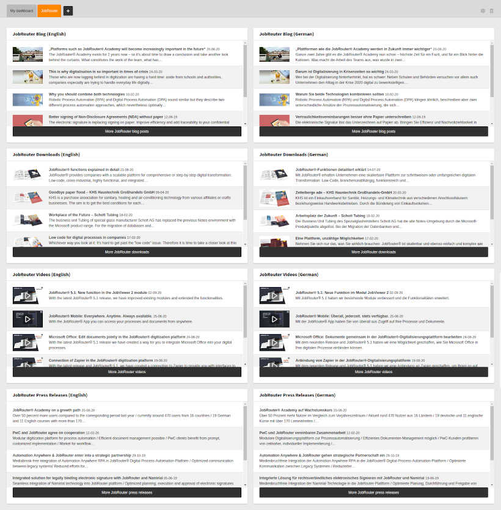

.. _introduction:

============
Introduction
============

`JobRouter <https://www.jobrouter.com/>`_ is a scalable digitisation platform
which links processes, data and documents. The TYPO3 extension `TYPO3 JobRouter
RSS Widgets <https://github.com/brotkrueml/typo3-jobrouter-rss-widgets>`_
displays the content of RSS feeds from the JobRouter website to keep you
informed about new content such as videos or downloads.

What does it do?
================

You can select dashboard widgets from various RSS feeds in different languages:

   Dashboard with all available JobRouter RSS widgets

For the differences between the versions have a look at the `change log
<https://github.com/brotkrueml/typo3-jobrouter-rss-widgets/blob/master/CHANGELOG.md>`_.
