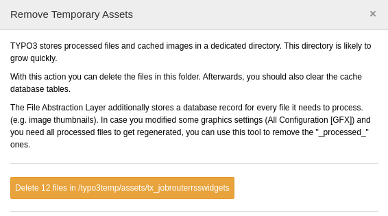

.. _maintenance:

===========
Maintenance
===========

Target group: **Integrators, Administrators**

Clean up generated thumbnails
=============================

The generated thumbnails are stored in the folder
:file:`typo3temp/assets/tx_jobrouterrsswidgets`. You can delete all generated
thumbnails to free up disk space. Go to :guilabel:`Admin Tools` >
:guilabel:`Maintenance` and click the :guilabel:`Scan temporary files` button
in the :guilabel:`Remove Temporary Assets` panel. A modal appears, click the
:guilabel:`Delete xx files in /typo3temp/assets/tx_jobrouterrsswidgets` (where
``xx`` is the number of existing files):

   Modal "Remove temporary assets"

.. important::

   You must clear the cache afterwards, otherwise the contents of the widgets
   will be displayed with broken thumbnails.

.. note::

   After deleting the cached thumbnails, the display of the JobRouter RSS
   widgets in the dashboard slows down on the first hit because the required
   thumbnails are recreated.
