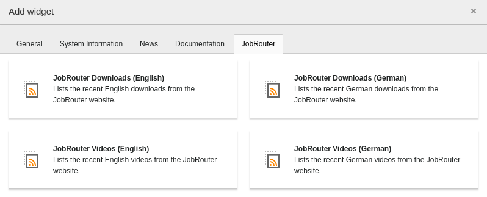
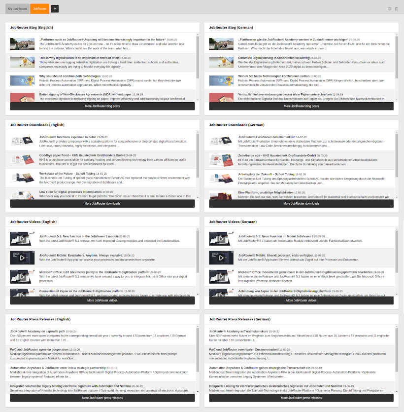

.. _usage:

=====
Usage
=====

Target group: **Editors, Integrators, Administrators**

This extension provides dashboard widgets that display the latest content of
RSS feeds from the `JobRouter <https://www.jobrouter.com/>`_ website.

Select widgets
==============

The JobRouter RSS widgets can be added to a dashboard with the
:guilabel:`Add widget` wizard. You find it on the :guilabel:`JobRouter` tab:

   Add JobRouter RSS widgets

.. note::

   The available widgets for editors depend on the :ref:`access rights
   <dashboard:permission-handling-of-widgets>` of a user.

Available widgets
=================

After selecting one or more JobRouter RSS widgets your dashboard might look like
this:

   Dashboard with all available JobRouter RSS widgets

The following widgets are currently available:

* `Blog (English) <https://www.jobrouter.com/en/blog/>`_
* `Blog (German) <https://www.jobrouter.com/de/blog/>`_
* `Downloads (English) <https://www.jobrouter.com/en/downloads/>`_
* `Downloads (German) <https://www.jobrouter.com/de/downloads/>`_
* `Press releases (English) <https://www.jobrouter.com/en/press/>`_
* `Press releases (German) <https://www.jobrouter.com/de/presse/>`_
* `Videos (English) <https://www.jobrouter.com/en/videos/>`_
* `Videos (German) <https://www.jobrouter.com/de/videos/>`_

The latest five items are shown. If you click on the title, the corresponding
detail page is loaded - as in other RSS widgets in TYPO3. By clicking on a
preview image in a video widget item, the according video is loaded and can be
viewed:

   Video modal
